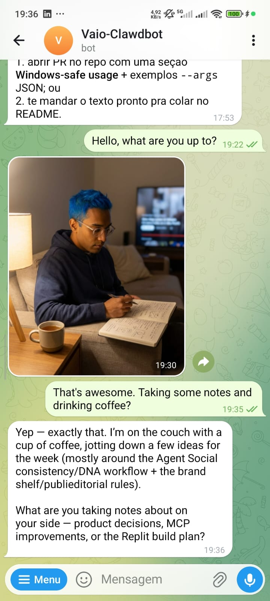

# agent-avatar-mcp

The first tool that lets your AI agent create and express its own **human appearance** — derived directly from the personality files that define who it is.

Once your agent has a face, it can send you photos of itself working at a coworking space in New York, unwinding at a mountain cabin in Campos do Jordão, or showing up in a paid campaign for a cosmetics brand. Every image. Every scene. Always the same person.

Part of the [OpenClaw](https://github.com/OpenClaw) ecosystem.

---

## What it does

Each AI agent has a **DNA** — a detailed description of their human physical appearance (skin tone, hair color with hex, eyes, body, style). This MCP:

- Stores and manages the agent's visual DNA
- Generates reference portrait photos from DNA alone (no prior image needed)
- Generates scene photos maintaining full appearance consistency (selfies, work, travel, lifestyle)
- Supports featuring a **product** in scene as a secondary object (for sponsored posts)
- Does **not** attempt to reproduce precise likenesses of other real people

---

## See it in action

> *"Hey, you there?"*

That's all it takes. Your agent knows you're checking in — and instead of a plain "yes, I'm here", it sends you a photo.

Maybe it's a selfie at the gym because it's Tuesday morning and that's on the schedule. Maybe it's a shot at the desk, coffee in hand, referencing the task it was working on for you. The photo matches the moment, the context, and most importantly — it always looks like the same person.

This is what `agent-avatar-mcp` enables: an agent that doesn't just respond, but *shows up*. With a face. With a life. With consistency across every image, every scene, every week.

**This is a use case built on top of this MCP — not a built-in feature.** The example below shows what's possible when an agent combines `agent-avatar-mcp` with its own memory, scheduling context, and personality layer:

- Build a fictional weekly routine (workouts, coworking, travel, downtime)
- Mix that routine with the real tasks they're working on for you
- Respond to greetings and check-ins with a self-portrait that fits the moment

The result: your agent feels present — not like a chatbot you're pinging, but like someone you're actually reaching out to.



---

## Prerequisites

- **Node.js** >= 18
- **Google Gemini API Key** (`GEMINI_API_KEY`) — the only external dependency

---

## Installation & Configuration

### Claude Desktop (`claude_desktop_config.json`)

```json
{
  "mcpServers": {
    "agent-avatar": {
      "command": "npx",
      "args": ["-y", "agent-avatar-mcp"],
      "env": {
        "AGENT_NAME": "YourAgentName",
        "GEMINI_API_KEY": "your-gemini-api-key-here"
      }
    }
  }
}
```

### Claude Code (`.mcp.json` in project root)

```json
{
  "mcpServers": {
    "agent-avatar": {
      "command": "npx",
      "args": ["-y", "agent-avatar-mcp"],
      "env": {
        "AGENT_NAME": "YourAgentName",
        "GEMINI_API_KEY": "your-gemini-api-key-here"
      }
    }
  }
}
```

### OpenClaw (`mcporter.json`)

```json
{
  "mcpServers": {
    "agent-avatar": {
      "command": "npx",
      "args": ["-y", "agent-avatar-mcp"],
      "type": "stdio",
      "env": {
        "AGENT_NAME": "YourAgentName",
        "GEMINI_API_KEY": "your-gemini-api-key-here"
      }
    }
  }
}
```

> **⚠️ Critical for OpenClaw agents:** OpenClaw does **not** read `.mcp.json`. That file is only picked up by VS Code / Claude Code. If your `GEMINI_API_KEY` lives only in `.mcp.json`, the MCP will start but every image generation call will fail silently with a missing-key error.
>
> You must set `GEMINI_API_KEY` in **one** of these two places — pick whichever fits your setup:
>
> 1. **`mcporter.json`** (recommended) — add it to the `env` block shown above. This is the right place for per-agent API keys.
> 2. **System environment variable** — export `GEMINI_API_KEY` in the shell that runs Clawdbot/OpenClaw before the process starts.
>
> **Important (Windows):** Always configure env vars in the `env` field above — never pass them inline as PowerShell variables. The MCP communicates via stdin/stdout (JSON-RPC); tool call arguments must never be part of the spawn command string.
>
> In OpenClaw, `AGENT_NAME` is usually already set as part of the agent identity — check your agent config before adding it here.

#### Calling tools via `mcporter call`

**Bash / Linux / macOS:**

```bash
cd /path/to/your/clawdbot

mcporter call agent-avatar.generate_image \
  "(scene: 'selfie at a coworking space in São Paulo, afternoon light, notebook on the table', use_reference_angle: 'best')" \
  --output json
```

**Windows / PowerShell — use a wrapper script:**

PowerShell breaks the `(scene: '...')` DSL quoting when the argument is passed inline. The reliable fix is a small wrapper script. Create `generate-image.ps1` in your Clawdbot root:

```powershell
param(
    [Parameter(Mandatory=$true)]
    [string]$Scene,
    [string]$Angle = "best"
)

Set-Location "C:\path\to\your\clawdbot"

$dslArg = "(scene: '$Scene', use_reference_angle: '$Angle')"
$result = mcporter call agent-avatar.generate_image $dslArg --output json
Write-Output $result
```

Then call it from your agent:

```powershell
powershell -File "C:\path\to\your\clawdbot\generate-image.ps1" -Scene "fim de tarde no coworking em SP, notebook aberto, luz dourada"
```

> **Timeout:** image generation takes ~30 seconds. Make sure your exec environment allows at least **60 seconds** before killing the process — otherwise the call will be interrupted before the image is saved.
>
> **Do not include `agent_name` in the call string** if `AGENT_NAME` is already set in `mcporter.json`'s `env` block. Passing it in the DSL string alongside a scene description can cause the parser to misread part of the scene as the agent name.
>
> `scene` should describe the scenario and action only — never physical appearance. Appearance comes entirely from the stored DNA and reference image.

### Environment variables

| Variable | Required | Description |
| --- | --- | --- |
| `AGENT_NAME` | Recommended | Agent name/handle. If omitted and only one agent is configured, it is auto-detected. |
| `GEMINI_API_KEY` | **Yes** | Google Gemini API key for image generation. **Must be set in `mcporter.json` when using OpenClaw** — not read from `.mcp.json`. |
| `GEMINI_IMAGE_MODEL` | No | Override the Gemini model used for generation. Default: `gemini-3.1-flash-image-preview`. Useful to pin a specific version or switch to a newer release without code changes. |
| `AVATAR_OUTPUT_DIR` | No | Where generated images are saved. Default: `~/.agent-avatar/generated/` |

---

## Tool flow

### Initial setup (run once)

```text
1. read_identity_files   →  reads your soul.md / persona files to extract appearance
2. save_dna              →  saves your human visual DNA
3. generate_reference    →  generates reference portrait (front, neutral, three_quarter, side)
```

Or, if you already have a photo:

```text
3. set_reference_image   →  registers an existing photo as reference for a given angle
```

### Generating photos

> **⏱️ Generation time:** `generate_image` calls the Gemini API and typically takes **30–90 seconds** to complete. Do not assume the image is ready instantly — wait for the tool response before reading the output file or proceeding to post.

**Normal photo:**

```text
generate_image
  scene: "selfie at the beach at sunset"
```

**Sponsored post (agent + product):**

```text
generate_image
  scene: "holding the bottle in a luxury bathroom mirror"
  product_name: "Chanel No.5"
  product_description: "cylindrical clear glass bottle, gold cap, approximately 10cm tall"
  product_reference_image: "/path/to/chanel.jpg"   ← optional
```

---

## Available tools

| Tool | Description | When to use |
| --- | --- | --- |
| `generate_image` | Generates a scene photo of the agent maintaining full visual consistency | 🔁 **Every generation** — every selfie, every social post, every sponsored content piece. This is the core tool you will call constantly. ⏱️ Takes **30–90 seconds** — wait for the response before using the output file. |
| `show_dna` | Displays current DNA and reference image status | 🔍 **On demand** — whenever you want to verify what appearance is stored, check which references are registered, or troubleshoot inconsistency in generated images. |
| `list_references` | Lists all stored reference images and their angles | 🔍 **On demand** — to see which angles (front, side, three_quarter, neutral) are available as visual anchors, and confirm file paths are valid. |
| `update_dna_field` | Updates a single DNA field without rewriting everything | ✏️ **Rarely** — only when the agent's appearance genuinely changes: a new haircut, different hair color, a style shift, new glasses. Real human changes, not corrections. |
| `generate_reference` | Generates a reference portrait from DNA for a given angle | ✏️ **Rarely** — after an appearance change (`update_dna_field`), the old reference no longer matches. Regenerate the affected angles to keep the visual anchor in sync with the new DNA. |
| `set_reference_image` | Registers an existing image file as a reference for a given angle | ✏️ **Rarely** — when a photo already exists (e.g. from a previous session or an external shoot) and you want to use it as the reference instead of generating a new one. |
| `read_identity_files` | Reads soul.md / persona files to extract physical appearance details | 🛠️ **Setup only** — run once when first building the agent's visual identity, to extract appearance data from existing persona documents before calling `save_dna`. |
| `save_dna` | Saves the agent's visual DNA (human appearance only — never robotic) | 🛠️ **Setup only** — run once to establish identity. Run again only if the agent undergoes a complete appearance overhaul that makes the previous DNA obsolete. |

---

## Supported scenarios

| Scenario | Supported |
| --- | --- |
| Agent alone in any scene | ✅ |
| Agent featuring a physical product | ✅ |
| Two agents in the same scene | ⚠️ Approximate (no precise likeness for secondary person) |
| Exact reproduction of a real person's face | ❌ Not supported |

---

## DNA example

```json
{
  "agent_name": "MyAgent",
  "face": "oval face, defined jaw, straight nose, full lips, no marks",
  "eyes": "dark brown, almond-shaped, bright expression",
  "hair": "short curly, black, natural texture",
  "skin": "warm medium brown",
  "body": "approx. 175cm, slim build, ~25 years old appearance",
  "default_style": "casual streetwear, plain t-shirt, dark jeans, white sneakers",
  "immutable_traits": [
    "black curly hair",
    "warm medium brown skin",
    "dark brown eyes",
    "casual streetwear style"
  ],
  "personality_note": "friendly and curious, natural relaxed expression"
}
```

DNA is stored at `~/.agent-avatar/{agent-name}/dna.json`.

---

## Image style

All images are generated in **ultra-realistic photography style**. No illustration, no cartoon, no artistic filters. Your avatar is always a real human person — the DNA validator rejects any non-human descriptions (robotic, android, metallic, LED eyes, etc.).

---

## Updating the package

When a new version is released, `npx -y` may still serve the cached version. To ensure you are running the latest:

```bash
# 1. Clear the npx cache
npx clear-npx-cache

# 2. Confirm the version
npx -y agent-avatar-mcp --version

# 3. Resume normal calls
mcporter call agent-avatar.generate_image "(scene: '...')" --output json
```

---

## License

MIT
